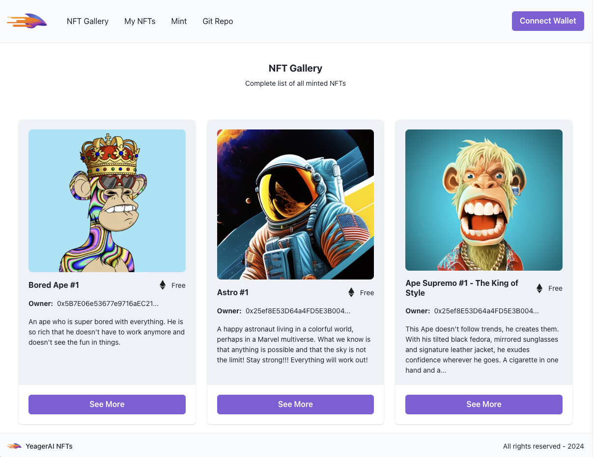
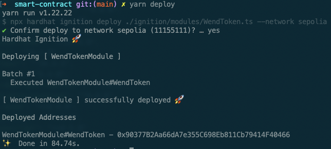

# Yeager AI Web3 Integration - DApp

This is a DApp developed as part of a Web3 integration project where fronts such as Backend, Frontend and Smart Contract (Blockchain Ethereum) are worked on with the objective of managing NFTs. This DApp allows users to manage and interact with NFTs.

Users can view all minted NFTs, check their personal collection of NFTs, and mint new NFTs. The application connects to a blockchain network to fetch and display NFT data, providing a seamless user experience for interacting with smart contracts.

<a href="https://yeager-ai-web3-integration.vercel.app/" target="_blank">**The DApp is live here. Click here to access it!**</a>



## 1. Running the Project Locally

To run the DApp locally, ensure you have the appropriate `.env` files in the respective directories.

### Env Configuration

- **Client (`client/.env.local`)**:

```sh
REACT_APP_API_URL=http://localhost:3001
REACT_APP_PINATA_JWT=<YOUR_PINATA_JWT>
REACT_APP_GATEWAY_URL=<YOUR_PINATA_GATEWAY_URL>
# Alchemy API key for Sepolia network
REACT_APP_ALCHEMY_API_KEY=<YOUR_ALCHEMY_API_KEY>
# Smart Contract Address
REACT_APP_CONTRACT_ADDRESS=0x98437a94C9b2335Fe56fCAb0bA14e327976d2573
# Skip sourcemap generation while developing
GENERATE_SOURCEMAP=false
```

- **Server (`server/.env`)**:

```sh
PORT=3001
PINATA_JWT=<YOUR_PINATA_JWT>
PINATA_GATEWAY_URL=<YOUR_PINATA_GATEWAY_URL>
NODE_ENV=development
```

- **Smart Contract (`smart-contract/.env`)**:

This is required only if you are planning to change and deploy the contract.

```sh
SEPOLIA_RPC_URL=https://eth-sepolia.g.alchemy.com/v2/<ALCHEMY_API_KEY>
# Account used to deploy the contract.
ACCOUNT_PRIVATE_KEY=<YOUR_ACCOUNT_PRIVATE_KEY>
```

**Obtaining Your Private Key**: To obtain the private key of your MetaMask account:

- Go to MetaMask -> Account Details
- Click "Show private key"
- Enter your password
- Click and hold the "Reveal Private Key" button
- Copy the private key

### Prerequisites:

To run the DApp locally, you will need to have the following dependencies installed:

- **Node Version Manager (NVM)**: Manages Node.js versions.
- **Node.js** version 18.18 (handled by nvm).
- **Yarn** for package management.

### Steps:

1. **Install NVM** (if not already installed): Follow the instructions for your operating system to install NVM [here](https://github.com/nvm-sh/nvm).

2. **Install Yarn** (if not installed): If you don't have Yarn globally installed, run the following command:

```sh
npm install --global yarn
```

3. **Clone the repository**: After cloning the repository, navigate to the project root directory.
4. **Set the Node.js version**: Run `nvm use` to switch to the correct Node.js version (18.18) as specified in the project.

```sh
nvm use
```

5. **Install dependencies**: In the project root, run the following command to install client, server, and smart-contract dependencies:

```sh
yarn install-dependencies
```

6. **Run the application**: To run both the server and client-side concurrently, use:

```sh
yarn start
```

This command will start both the backend and the frontend. The app should now be accessible in your local development environment here: [**http://localhost:3000**](http://localhost:3000).

### Production API:

The production API is hosted at `https://yeager-ai-web3-integration.onrender.com`. To check the health of the API, you can run:

```sh
curl --location 'https://yeager-ai-web3-integration.onrender.com/api/health-check'
```

### Current Production Smart Contract:

The production Smart contract is `0x98437a94C9b2335Fe56fCAb0bA14e327976d2573`.

Contract at Sepolia Etherscan: [**https://sepolia.etherscan.io/address/0x98437a94C9b2335Fe56fCAb0bA14e327976d2573**](https://sepolia.etherscan.io/address/0x98437a94C9b2335Fe56fCAb0bA14e327976d2573)

## 2. Technologies Used and Application Architecture

### Client-Side:

- **React**: Utilized for building the user interface.
- **TypeScript**: Used to add type safety throughout the app.
- **Redux**: Manages the application's global state.
- **Chakra UI**: Provides a responsive and accessible design system.
- **ESLint**: Tool used to lint the code and maintain a code pattern.
- **Zod**: Used to create validation schemas for forms, ensuring data integrity and user input validation.

### Server-Side (API):

- **Node.js and Express**: Power the backend API that handles requests related to metadata creation and upload to Pinata.
- **TypeScript**: Ensures type safety in the backend as well.
- **Zod**: Used for validating requests, such as metadata creation, to ensure that incoming data adheres to the expected schema.

### Blockchain Interaction:

- **Ethers.js**: Used to connect with the blockchain and interact with smart contracts.
- **Contract Functions**: Exposed in a `contract.ts` file, which handles interactions with the smart contract.
- **contract-abi.json**: Contains the ABI (Application Binary Interface) for the NFT smart contract.
- **MetaMask**: When MetaMask (`window.ethereum`) is detected, it is used as the primary provider for fetching data from the blockchain and interacting with the smart contract.
- **Alchemy**: If MetaMask is not available, **Alchemy** is used as the fallback provider to fetch public contract data such as the list of NFTs.
- **Hardhat**: Employed for managing and deploying smart contracts. Specifically, it handles the `WendToken.sol` contract.
- **Testing**: **Remix IDE** was used to test contract functions with various data inputs.

### Contract Deployment

You should compile the contract with `yarn compile`, which generates the ABI in `artifacts/contracts/WendToken.sol/WendToken.json`. This ABI is required by the client to interact with the contract.

After compiling the contract, use `yarn deploy` to deploy it. Ensure that all necessary environment variables for the smart contract are properly configured before deployment. You should see something like this:



## 3. Assumptions and Decisions

### Client:

1. **Folder Structure**: The project follows a modular folder structure where components, hooks, and utilities shared across the app are kept in global directories (`src/components`, `src/hooks`, etc.). Page-specific components, hooks, and models are stored within their respective page folders (e.g., `pages/mint/components`, `pages/mint/hooks`, etc.).

2. **Contract Handling**: All smart contract logic is centralized in the `src/blockchain` folder, with key functions and contract interactions managed in `contract.ts`. This keeps blockchain-specific logic separated from the core business logic.

3. **Global Exports**: For better maintainability, all folders with reusable components or utilities include an `index.ts` file to aggregate and export all elements, simplifying imports throughout the app. For example, components can be imported using:

```ts
import { NftCard } from "@/components";
```

4. **Alias Configuration**: A TypeScript alias `@` is used to point to the `src` directory, which simplifies import paths and improves code readability.

### Client Folder Structure:

```
src/
│
├── api/
│   └── index.ts
│   ├── api.ts
├── blockchain/
│   ├── contract.ts    // Smart contract interactions
│   ├── provider.ts    // Blockchain provider setup
│   ├── wallet.ts      // Wallet connection logic
│   └── abi.json       // Smart contract ABI
├── components/
│   ├── NftCard.tsx    // NFT card component
│   ├── index.ts       // Export all components
│   └── ...tsx         // Other global components
├── hooks/
│   ├── index.ts       // Export all hooks
│   ├── use-wallet.ts  // Global hooks
│   └── ...ts          // Other global hooks
├── pages/
│   ├── mint/
│   │   ├── index.tsx  // Main mint page
│   │   ├── components/...
│   │   ├── hooks/...
│   │   └── models/...
│   └── gallery/ ...
├── services/
├── store/
├── utils/
├── App.tsx
└── index.tsx

```

### Server:

1. **Folder Structure**: The server follows a structured approach with specific directories for controllers, middlewares, routes, and services. Controllers handle route-specific logic, middlewares manage request processing, routes define API endpoints, and services interact with external systems such as Pinata.

2. **Global Exports**: The server also uses the `index.ts` approach to export all resources by context, similarly to the Client side.

### Server Folder Structure:

```
src/
├── controllers/        // Controllers for routes
│   ├── metadata/
│       ├── create.ts
│       └── index.ts
│   ├── others/...
├── middlewares/
├── routes/
│   ├── index.ts
│   ├── metadata.ts     // Metadata routes
│   └── health-check.ts // Health check route
├── services/
│   ├── index.ts
│   └── pinata.ts       // Pinata API interactions
├── constants.ts        // Environment variables
└── index.ts

```
